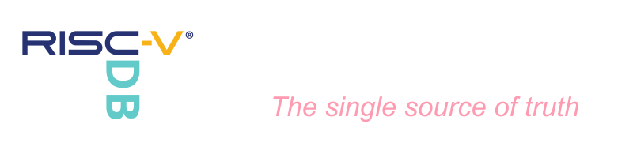

image::https://api.reuse.software/badge/github.com/riscv/riscv-unified-db[REUSE status, link="https://api.reuse.software/info/github.com/riscv/riscv-unified-db"]

[NOTE]
----
A new from-scratch documentation site for this project is under construction.
It is available at https://riscv.github.io/riscv-unified-db/docs-preview/[riscv.github.io/riscv-unified-db/docs-preview].
Content is incomplete and actively being developed, but is likely still helpful.
----

[WARNING]
----
This project is under rapid development. Expect schemas and APIs to change.

The data in the `spec` directory is also a work in progress and may be incorrect.

That said, the following data has been validated against third-party sources:

* Instruction encodings are validated to match riscv-opcodes
* Instruction names and assembly formats are validated against LLVM.
----

== Quick links

* https://riscv.github.io/riscv-unified-db/index.html[The latest UDB-generated **UNOFFICIAL** RISC-V specifications].
* UDB Documentation
** xref:doc/schemas.adoc[Schema documentation]
** xref:doc/idl.adoc[ISA Description Language (IDL)]
** link:doc/python-api.md[Python database package]
* How-to/recipes
** xref:CONTRIBUTING.adoc[Contribution guidelines]
** xref:doc/data-templates.adoc[Data templates]
** xref:doc/riscv-opcodes-migration.adoc[`riscv-opcodes` migration]
** link:doc/python-migration-command-map.md[Migration command map]
** link:doc/python-migration.md[Ruby-to-Python migration history]
** link:doc/python-migration-bugfixes.md[Ruby defects corrected in the Python migration]

== Overview

The goal of the RISC-V Unified Database (UnifiedDB/UDB) is to hold *all* the information needed to describe RISC-V,
including a list of extensions, instruction specifications, CSR specifications, and documentation prose. The vision is that anything one would need for RISC-V can be generated from the information in this repository.

In addition to storing the data, UnifiedDB also provides many tools that use the data to generate
artifacts such as specification documents, toolchain inputs, and simulators.

UnifiedDB is an open-source, worldwide project.
Contributors do not need to be members of https://riscv.org[RISC-V International (RVI)],
though maintainers discuss strategic direction and coordinate with the RISC-V standard through the
https://lf-riscv.atlassian.net/wiki/x/iwCsCw?atlOrigin=eyJpIjoiYzU3N2ZiNDViMGRkNGE3ODg0ODVlOWU5YzgzYWM2ODMiLCJwIjoiYyJ9[UnifiedDB Special Interest Group (UDB SIG)] at RVI.

== Repository structure

The following directories contain information relevant to most users of UnifiedDB

* `spec`: Holds all data specification files, along with their schemas
* `spec/std`: The RISC-V standard
* `spec/custom`: Non-standard RISC-V extensions
* `spec/schemas`: Data schemas for the specification content
* `cfgs`: Configurations used by backends to customize generated outputs

Additionally, developers will be interested in the following:

* `src/udb`: Python package, command-line interface, IDL compiler, and generators
* `backends`: Retained templates and native support files used by generators
* `tools/dev`: Implementation of repository development tasks
* `tests`: Python, native, package, editor, and integration tests

== Getting Started

=== Use UDB

The Python package provides the `udb` command and API. From a checkout, `uv run`
uses the project environment without requiring manual activation:

[source,bash]
----
uv run udb show instruction add
uv run udb --help
----

An installed wheel exposes the same command directly as `udb`. It can query and
resolve data, validate configured architectures, compile IDL, and generate retained
artifacts without Ruby or a repository checkout. See the
link:doc/python-api.md[Python API guide] and run `uv run udb --help` for the current
command tree.

=== Prerequisites

Repository development uses https://mise.jdx.dev[mise]. Install `mise`, clone this
repository, and run the setup task from the repository root.

A container runtime (Docker or Podman) is optional. It is only required for building generated
C++ ISS code when a suitable native C++ toolchain and/or RISC-V cross-compiler is unavailable natively.

Core Python, documentation, and editor workflows run natively. The external
Asciidoctor toolchain is used only when rendering generated AsciiDoc. A container
runtime is optional for native C++ and cross-toolchain work.

=== Native Setup (mise)

From the repo root, run:

[source,bash]
----
mise run setup
----

The setup task installs configured tools and dependencies, installs the repository
hooks, and selects an available native or container C++ toolchain. It is safe to
run again. Use `mise run setup -- --toolchain none` when native builds are not
needed.

=== Verify the installation

Verify the configured development environment with:

[source,bash]
----
mise run doctor
----

If the doctor reports a problem, follow its diagnostic and rerun `mise run setup`
after correcting the environment.
=== Tasks

[source,bash]
----
mise tasks                   # list repository development tasks
mise run test                # run the default Python tests
mise run check               # run retained validation and quality checks
mise run check:all           # run every check exercised by CI
mise run gen:all             # regenerate retained developer artifacts
uv run udb --help            # show the installed UDB command tree
----

The link:doc/python-migration-command-map.md[migration command map] records the
replacement for common commands removed with the Ruby toolchain.
