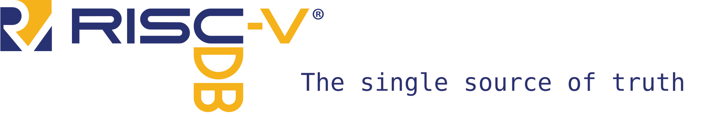

image::https://api.reuse.software/badge/github.com/riscv-software-src/riscv-unified-db[REUSE status, link="https://api.reuse.software/info/github.com/riscv-software-src/riscv-unified-db"]

[WARNING]
----
This project is under rapid development. Expect schemas and APIs to change.

The data in the `spec` directory is also a work in progress and may be incorrect.

That said, the following data has been validated against third-party sources:

* Instruction encodings are validated to match riscv-opcodes
* Instruction names and assembly formats are validated against LLVM.
----

== Quick links

* https://riscv-software-src.github.io/riscv-unified-db/index.html[The latest UDB-generated **UNOFFICIAL** RISC-V specifications].
* UDB Documentation
** xref:doc/schemas.adoc[Schema documentation]
** xref:doc/idl.adoc[ISA Description Language (IDL)]
** xref:doc/ruby.adoc[Ruby database interface]
* How-to/recipes
** xref:CONTRIBUTING.adoc[Contribution guidelines]
** xref:doc/data-templates.adoc[Data templates]
** xref:doc/riscv-opcodes-migration.adoc[`riscv-opcodes` migration]

== Overview

The goal of the RISC-V Unified Database (UnifiedDB/UDB) is to hold *all* the information needed to describe RISC-V,
including a list of extensions, instruction specifications, CSR specifications, and documentation prose. The vision is that anything one would need for RISC-V can be generated from the information in this repository.

In addition to storing the data, UnifiedDB also provides many tools that use the data to generate
artifacts such as specification documents, toolchain inputs, and simulators.

UnifiedDB is an open-source, worldwide project.
Contributors do not need to be members of https://riscv.org[RISC-V International (RVI)],
though maintainers discuss strategic direction and coordinate with the RISC-V standard through the
https://lf-riscv.atlassian.net/wiki/x/iwCsCw?atlOrigin=eyJpIjoiYzU3N2ZiNDViMGRkNGE3ODg0ODVlOWU5YzgzYWM2ODMiLCJwIjoiYyJ9[UnifiedDB Special Interest Group (UDB SIG)] at RVI.

== Repository structure

The following directories contain information relevant to most users of UnifiedDB

* `spec`: Holds all data specification files, along with their schemas
* `spec/std`: The RISC-V standard
* `spec/custom`: Non-standard RISC-V extensions
* `spec/schemas`: Data schemas for the specification content
* `cfgs`: Configurations used by backends to customize generated outputs

Additionally, developers will be interested in the following:

* `backends`: Tools to generate artifacts (documents, simulators, etc.) from UDB data
* `tools/ruby-gems`: Ruby gem libraries for interacting with UDB / IDL
* `bin`: Wrapper scripts to run commands within the container environment

== Getting Started

=== Prerequisites

UnifiedDB tools are set up to run in a container. Both Docker (any version) and Singularity/Apptainer (`Singularity CE >= 3.3` or `Apptainer >= 1.0`) are supported.

=== Devcontainer

You can also leverage https://containers.dev/[devcontainers] to run the RISC-V Unified Database.

This is especially useful when using Visual Studio Code or GitHub codespaces, as it will setup up your IDE environment for you.

==== VS Code

To run the devcontainer locally, you will need to have https://docs.docker.com/engine/install[Docker installed].

With Docker installed, install the https://marketplace.visualstudio.com/items?itemName=ms-vscode-remote.remote-containers[Dev Containers] extension in VS Code.

You can then run `Dev Containers: Open Folder in Container...` from the Command Palette (Ctrl+Shift+P) and select the folder with this repository.

==== GitHub Codespaces

You can start a GitHub Codespace for this repository by clicking the "Code" button and selecting "Open with Codespaces".

=== Tasks

UnifiedDB uses https://github.com/ruby/rake[Rake], a Ruby-based Makefile alternative, to manage tasks.
For convenience, running Rake inside the container is encapsulated in `do`. For example:

[source,bash]
----
./do --tasks                 # list all documented tasks
./do --desc gen:html_manual  # describe the 'gen:html_manual' task in more detail

./do test:smoke              # run smoke tests

# generate all versions of ISA manual, as an Antora static website
./do gen:html_manual MANUAL_NAME=isa VERSIONS=all

# regenerate yaml files for the unresolved architecture
./do gen:arch

# generate an implementation-specific spec for the 'example_rv64_with_overlay' config
./do gen:resolved_arch CFG=example_rv64_with_overlay
----
